# Traffic Sign Recognition
---

**Build a Traffic Sign Recognition Project**

The goals / steps of this project are the following:
* Load the data set (see below for links to the project data set)
* Explore, summarize and visualize the data set
* Design, train and test a model architecture
* Use the model to make predictions on new images
* Analyze the softmax probabilities of the new images
* Summarize the results with a written report

---

## Data Set

The provided data is a collection of:

* training set
 * **34799** images
* validation set
 * **4410** images
* test set
 * **12630** images

The images are RGB color, **32x32** pixels. Some examples:

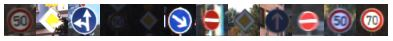

There are **43** sign classes. Each set also contains the class ids for the images.

The training set is not balanced. Samples per class range from **180** to **2010**. This imbalance might have a negative impact on the CNN's performance.

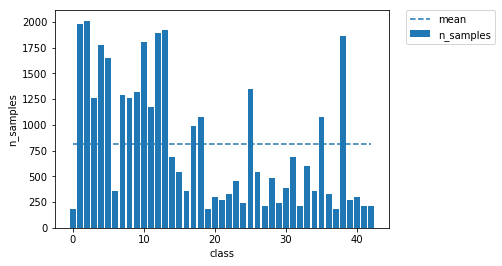

* max samples/class  : **2010**
* min samples/class  : **180**
* mean samples/class : **809.28**

---

## Preprocessing

I have used a LeNet model for some initial testing on the data.

I was interested to see if converting the images to grayscale would affect the performance of the classification. Using grayscale images would reduce the data size hence improve the speed and memory footprint of the computations. I converted the images to the [CIE Lab](https://en.wikipedia.org/wiki/Lab_color_space) color space and extracted the L (lightness) channel. The CIE Lab color space seemed advantageous because it is modelled to approximate human vision.

Some of the images were also quite dark and under exposed so I tested methods to equalize the images.

| input         		| validation accuracy	           |
|:---------------------:|:--------------------:|
| RGB color        		| 89.7%                |
| CIE LAB L channel   	| 91.8%                |
| L channel + opencv equalize                  | 91.5% |
| L channel + opencv CLAHE                  | 93.5% |
| L channel + skimage CLAHE | 95.1% |

I have found that converting the images to [CIE Lab](https://en.wikipedia.org/wiki/Lab_color_space), extracting the Lightness channel and applying the [CLAHE filter from skimage](http://scikit-image.org/docs/dev/api/skimage.exposure.html#skimage.exposure.equalize_adapthist) provided a 5%+ improvement over using the color images.

---

## Augmenting and Balancing

I looked for ways to create additional images and to balance the training set.

Some of the signs are symmetrical, so these can be flipped. For example **No Entry**:

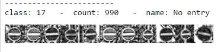

Some classes can be flipped and added to another class. For example **Dangerous Curve Left** -> **Dangerous Curve Right**:

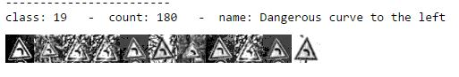
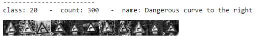

The **Roundabout** sign can be rotated 120° and 240°:

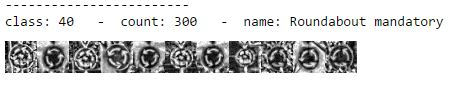

After flipping and rotating images, the traning set size increased from **34799** to **58978**. However the set became even more imbalanced:

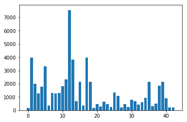

To create additional images, I have tested image transformations and filters. Some filters, for example adding noise, did not improve accuracy. I have found these transformations to enhance accuracy:

* random rotation -10° to 10°

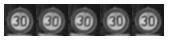

* random non-uniform scaling 80% to 120%

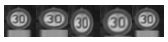

* random projection by moving the image corners up to 7 pixels

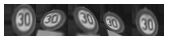

Using a random mixture of these transformations, I have augmented the training set so each class has the same number of images as the class with the maximum samples. This balance the training set, and increased the number of images almost 10 times to **325080**:

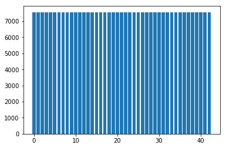

---

## Network Parameters

I have used Lenet-5 as my starting point with 32 epochs and ran tests to see how adjusting certain parameters affects the accuracy.

| learning rate    | test accuracy           |
|:---------------------:|:--------------------:|
| 0.0001 | 92.4%                |
| 0.0002 | 93.2%                |
| 0.0003 | 93.4%                |
| 0.0004 | 94.5%                |
| 0.0005 | 94.4%                |
| 0.0006 | 94.0%                |
| 0.0007 | 94.7%                |
| 0.0008 | 93.8%                |
| 0.0009 | 94.2%                |
| 0.0010 | 94.3%                |

| convolution K size    | test accuracy           |
|:---------------------:|:--------------------:|
| 2 | 93.2%                |
| 3 | 94.8%                |
| 4 | 94.5%                |
| 5 | 94.6%                |
| 6 | 93.6%                |
| 7 | 92.7%                |

Based on these tests I chose 0.0007 for learning rate and K=3 for convolution layers.

---

## Network Model

I have read Pierre [Sermanet and Yann LeCun's paper](https://www.kth.se/social/files/588617ebf2765401cfcc478c/PHensmanDMasko_dkand15.pdf) on Traffic Sign Classification where they combined the outputs of convolution layers. I have tried this approach and it provided a great increase in accuracy. After experimenting with sizes and numbers of convolution and fully connected layers, this is the network architecture I ended up with:

| layer                 |  parameters        | output     |
|:---------------------:|:------------------:|:----------:|
| Input                 | L channel image    | 32x32x1    |
| Convolution 1         | K=3, S=1, D=64     | 32x32x64   |
| RELU                  |                    |            |
| MaxPool 1             | K=2, S=2           | 16x16x64   |
| Dropout               | 0.6                |            |
| Convolution 2         | K=3, S=1, D=128    | 16x16x128  |
| RELU                  |                    |            |
| MaxPool 2             | K=2, S=2           | 8x8x128    |
| Dropout               | 0.5                |            |
| Convolution 3         | K=3, S=1, D=256    | 8x8x256    |
| RELU                  |                    |            |
| MaxPool 3             | K=2, S=2           | 4x4x256    |
| Dropout               | 0.6                |            |
| Convolution 4         | K=3, S=1, D=512    | 4x4x512    |
| RELU                  |                    |            |
| MaxPool 4             | K=2, S=2           | 2x2x512    |
| Dropout               | 0.6                |            |
| Flatten               | concat MaxPool 1-4 | 30720      |
| Fully Connected 1     | L2 regularization  | 4096       |
| RELU                  |                    |            |
| Dropout               | 0.6                |            |
| Fully Connected 2     | L2 regularization  | 1024       |
| RELU                  |                    |            |
| Dropout               | 0.7                |            |
| Fully Connected 3     | L2 regularization  | 43         |
| Sigmoid               |                    |            |

All convolution and max pooling layers use 'SAME' padding and K and S values are same on x and y axis.

TensorBoard representation of the network graph:

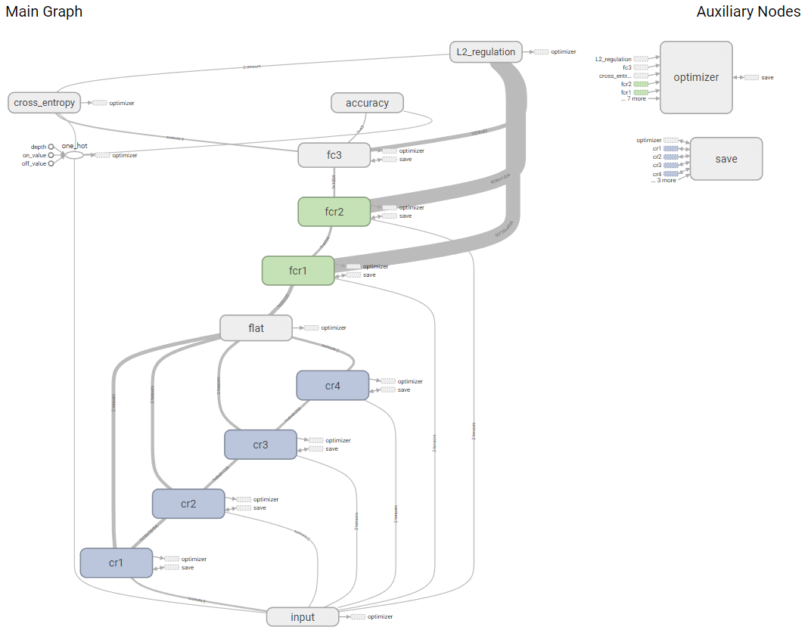

---

## Overfitting

To avoid overfitting, I have added dropout and L2 regularization based on the [CS231n Convolutional Neural Networks for Visual Recognition](http://cs231n.github.io/neural-networks-2/) paper.

Dropout is applied to all convolution and fully connected layers, with the exception of the last fully connected layer (Fully Connected 3).

L2 regularization is applied to the fully connected layer weights.

---

## Accuracy

The validation accuracy at 64 epocs is **98.9%** (highest at epoch 38: **99.5%**) and the test accuracy is **98.5%**. After 64 epochs the accuracy doesn't improve significantly.

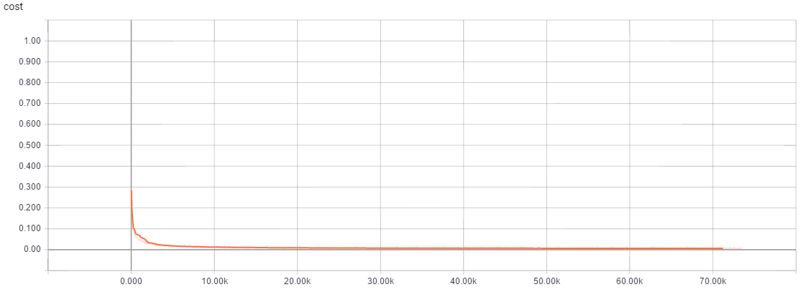
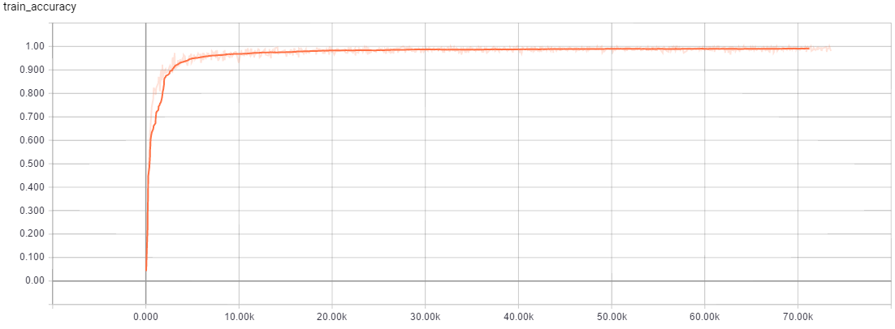

(Note: I trained the network from a standalone python script outside of the jupyter notebook to obtain the TensorBoard graphs. The Jupyter notebook also contains a similar plot.)

---

## Test Images from WWW

I have looked for random german traffic sign images on the internet. Here are some of the color images I've found:

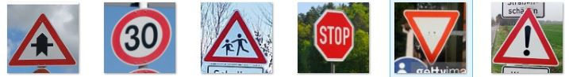

The images after resizing to 32x32 and preprocessing:

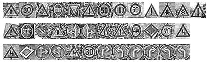

There are **47** images in total.

---

### Accuracy

Predictions from the trained model:
* number of images: **47**
* correct predictions: **44**
* incorrect predictions: **3**
* accuracy: **93.6%**

The accuracy is similar to the accuracy of the validation images. I have found that the images from the internet have considerably more noise, probably due to JPEG compression or higher dynamic range of cameras they were taken with.

---

### Correct Classifications

Most of the signs are classified with great confidence. Some of the correctly classified images and their softmax probabilities:

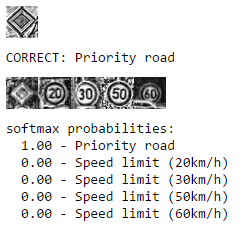
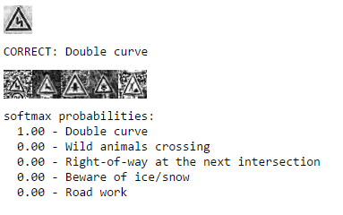
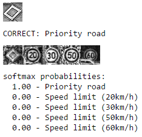

---

### Incorrect Classifications

The three signs that are not correctly classified with softmax porobabilities:

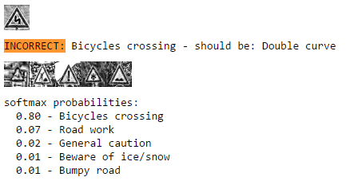
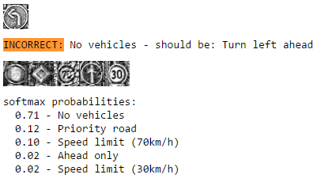
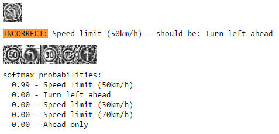

---

## Feature Maps

To examine how features are identified by the network I have captured feature maps from some activations through the network.

My network uses large depths (for example Convolution 3 has a depth of 256) so only a subset of feature maps are shown here for each activation.

The feature maps are generated for this **General Caution** sign:

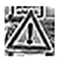

### RELU after Convolution 1

The feature maps show high activation for the angled outlines of the sign and the verticals of the exclamation mark.

The maximum value of these feature maps is **1.22**.

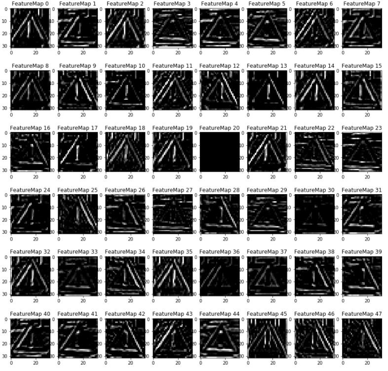

### RELU after Convolution 2

The lines of the triangle for the sign's shape and the vertical line in the middle are even more pronounced on this next layer.

The maximum value of these feature maps is much higher at **13.22**.

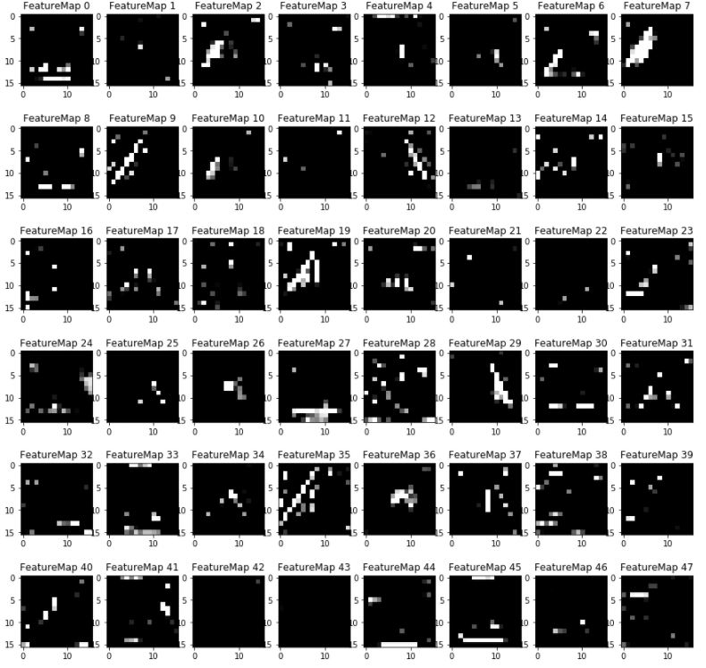

### RELU after Convolution 3

The feature maps at this layer are only 8x8, but the outlines of the triangle and the vertical line in the middle are at even higher values while the rest of the areas are at 0.

The maximum value of these feature maps is much higher at **355.72**.

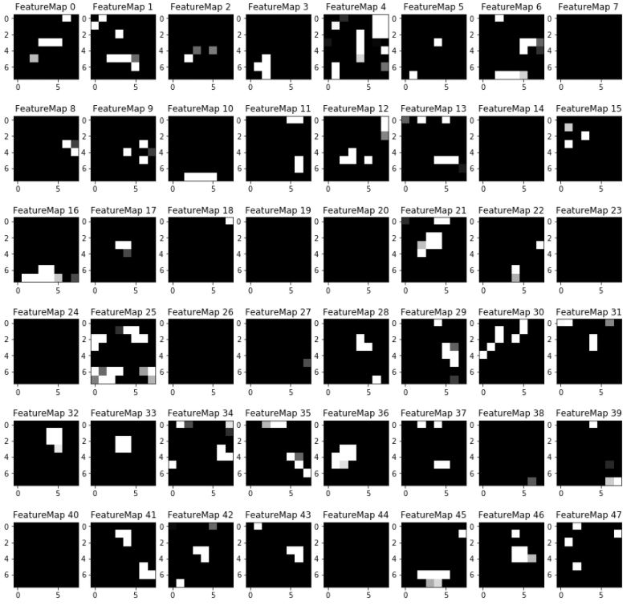

